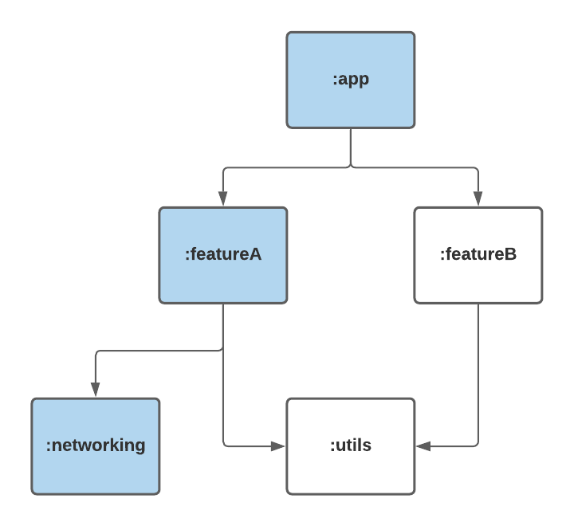

# Affected Module Detector

[](https://maven-badges.herokuapp.com/maven-central/com.dropbox.affectedmoduledetector/affectedmoduledetector/)

[](https://travis-ci.org/dropbox/AffectedModuleDetector)

[](https://codecov.io/gh/dropbox/AffectedModuleDetector)

A Gradle Plugin to determine which modules were affected by a set of files in a commit.  One use case for this plugin is for developers who would like to only run tests in modules which have changed in a given commit.

## Overview

The AffectedModuleDetector will look at the last commit and determine which files have changed, it will then build a dependency graph of all the modules in the project.   The detector exposes a set of APIs which can be used to determine whether a module was considered affected.

### Git

The module detector assumes that it is being applied to a project stored in git and a git client is present on the system.  It will query the last commit on the current branch to determine the list of files changed.

### Dependency Tracker

The tracker will evaluate the project and find all modules and their dependencies for all configurations.

### Affected Module Detector

The detector allows for three options for affected modules:
 - Changed Projects: These are projects which had files changed within them
 - Dependent Projects: These are projects which are dependent on projects which had changes within them
 - All Affected Projects:  This is the union of Changed Projects and Dependent Projects

 These options can be useful depending on how many tests your project has and where in the integration cycle you would like to run them.  For example, Changed Projects may be a good options when initially sending a Pull Requests, and All Affected Projects may be useful to use when a developer merges their pull request.

The detector exposes APIs which will be helpful for your plugin to use.  In particular, it exposes:
 - AffectedModuleDetector.configureTaskGuard - This will apply an `onlyIf` guard on your task and can be called either during configuration or execution
 - AffectedModuleDetector.isProjectAffected - This will return a boolean if the project has been affected. It can only be called after the project has been configured.


In the example below, we're showing a hypothetical project graph and what projects would be considered affected if the All Affected Projects option was used and a change was made in the `:networking` module.


## Installation

Apply the project to the root `build.gradle`:
```
buildscript {
  repositories {
    maven()
  }
  dependencies {
    classpath "com.dropbox.affectedmoduledetector:affectedmoduledetector:<LATEST_VERSION>"
  }
}
//rootproject
apply plugin: "com.dropbox.affectedmoduledetector"
```

If you want to develop a plugin using the APIs, add this to your `buildSrc`'s `dependencies` list:
```
implementation("com.dropbox.affectedmoduledetector:affectedmoduledetector:<LATEST_VERSION>")
```

## Configuration

You can specify the configuration block for the detector in the root project:
```
affectedModuleDetector {
    baseDir = "${project.rootDir}"
    pathsAffectingAllModules = [
            "buildSrc/"
    ]
    logFilename = "output.log"
    logFolder = "${project.rootDir}/output"
}
```

 - `baseDir`: The root directory for all of the `pathsAffectingAllModules`.  Used to validate the paths exist.
 - `pathsAffectingAllModules`: Paths to files or folders which if changed will trigger all modules to be considered affected
 - `logFilename`: A filename for the output detector to use
 - `logFolder`: A folder to output the log file in
 
 
 
 Modules can specify a configuration block to specify which variant tests to run
 ```
 affectedTestConfiguration{
    variantToTest = "debug" //default is debug
}
```
 
 The plugin will create a few top level tasks that will assemble or run tests for only affected modules:
 * gradlew runAffectedUnitTests - runs jvm tests
 * gradlew runAffectedAndroidTests - runs connected tests
 * gradlew assembleAffectedAndroidTests - assembles but does not run on device tests, useful when working with device labs


## Sample Usage

To run this on the sample app, try running the following command:
```
./gradlew runAffectedUnitTests -Paffected_module_detector.enable
```

You should see zero tests run.  Make a change within one of the modules and commit it.  Rerunning the command should execute tests in that module and it's dependent modules.

## Notes

Special thanks to the AndroidX for originally developing this project at https://android.googlesource.com/platform/frameworks/support/+/androidx-master-dev/buildSrc/src/main/kotlin/androidx/build/dependencyTracker
